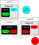

# MeshNetwork
How to use batman-adv to create a Mesh network


# Project Setup and Configuration

  

This repository contains the setup and configuration guide for a Mesh Network over WiFi on Raspberry Pis. Follow the steps below to get started.

  

## Table of Contents

  

1. [Prerequisites](#prerequisites)

2. [Configure Environment](#configure-environment)

3. [Startup Script](#startup-script)

  
  
  

## Prerequisites

  

Make sure you have the following prerequisites:

  

- Raspberry Pi 3B+ (Minimum 2)

- Ubuntu 22.04

- Batman-adv

  

## Configure Environment

  

### Step 1:

```bash
sudo apt-get update && sudo apt-get upgrade -y
```

### Step 2: Download Batman and extract files

```bash
curl -O https://downloads.open-mesh.org/batman/releases/batman-adv-2023.3/batman-adv-2023.3.tar.gz
tar -xvzf  batman-adv-2023.3.tar.gz
```

### Step 3: Install make and gcc

```bash
sudo apt install make
sudo apt-get install gcc
```

### Step 4: Compile source code and install batman on the system

```bash
cd batman-adv-2023.3/
sudo make all
```

```bash
sudo make install
```

### Step 5: Install batctl and network configuration tools
```bash
sudo apt install batctl
sudo apt install iw
sudo apt install net-tools
sudo apt install wireless-tools
```

### Step 6: Disable wpa_supplicant to freely configure network interfaces
#### Note: 
```bash
sudo service wpa_supplicant stop
```
```bash
sudo systemctl mask wpa_supplicant.service
```
Output:
Created symlink /etc/systemd/system/wpa_supplicant.service → /dev/null.

### Step 7: Configure interfaces
```bash
sudo ip link set <if> down  #e.g. <if> = wlan0
sudo iw <if> set type ibss #ibss means ad-hoc mode
sudo ifconfig <if> mtu 1468
sudo iwconfig <if> channel 3
sudo ip link set <if> up
sudo iw <if> ibss join <ssid> 2432  # e.g. <ssid> = my-mesh-network
```
### Step 8: Load the kernel module & Check it
```bash
sudo modprobe batman-adv
lsmod | grep "batman_adv"
```

### Step 9:
```bash
sudo batctl if add <if>#  e.g. <if> =  wlan0
sudo ip link set up dev <if>
sudo ip link set up dev bat0
sudo ifconfig bat0 172.27.0.1/16  # Can be any other valid IP.
```
### Step 10: Verify the Mesh Network

```bash
sudo iwconfig
```

Output:
lo        no wireless extensions.

eth0      no wireless extensions.

wlan0     IEEE 802.11  ESSID:"my-mesh-network"
          Mode:Ad-Hoc  Frequency:2.432 GHz  Cell: <mac_address>
          Tx-Power=31 dBm
          Retry short limit:7   RTS thr:off   Fragment thr:off
          Encryption key:off
          Power Management:on
bat0      no wireless extensions.


### Step 11: Print originators/neighbor nodes
```bash
sudo batctl o #Shows originators
sudo batctl n #Shows neighbor mesh nodes
```

### Step 12: Mixing non-B.A.T.M.A.N. systems with batman-adv
```bash
ip link add name br0 type bridge
ip link set dev br0 up
ip link set dev bat0 master br0
ip link set dev eth0 master br0
```


In this example, the blue wifi-client on node2 should be able to talk to the red ethernet client on node3. Even when they both don't have any knowledge about batman-adv or the medium (ethernet vs. wifi) of the remote client.

## Startup Script

After configuring the mesh network step by step, it would be easier to have a script that execute all steps in one command. Therefore, a script is provided to create the mesh network using a single command. First make the script executable using this command:

```bash
chmod +x /path/to/mesh-network-startup.sh
```
Later, launch the script:

```bash
sudo bash /path/to/mesh-network-startup.sh
```

### PS: Don't forget to change parameters in the script according to your needs.
